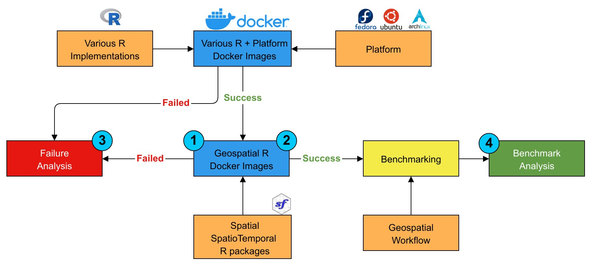

# Methodology {#methodology}

In this chapter, the methodology of the research is explained. For better understanding, the methodology is shown as in \@ref(fig:methodology). From this diagram, there are nine blocks that are grouped into 3 main parts. The first part is **Docker Images** that covers _Various R implementations_, _Platform_, _Various R + Platform Docker Images_, _Spatial and SpatioTemporal R packages_ and _Geospatial R Docker Image_. From this first part, the answer to the first and second research questions can be found. The second part is **Benchmarking** which covers _Geospatial Workflow_ and _Benchmarking_ block. And the last one is _Analysis_ that contains _Failure Analysis_ and _Benchmark Analysis_. This third will answer the third and fourth research questions. As shown in figure \@ref(fig:methodology), there four numbers that represent the location where the answer to each research question. In the following sections, each part is explained in detail.

```{r methodology, echo=FALSE, fig.align='center', fig.cap='Methodology', out.width = "400px"}

```

## Docker Images

The first step is creating Docker images for each combination of platform and R implementations without the geospatial R package. These Docker images (_Various R + Platform Docker Images_) are called Vanilla R Docker images for easier reference in this research. To create these Vanilla R Docker images, it needs to install the _Various R implementations_ on the _Platform_. The research uses 6 R implementations (GNU R, MRO, Renjin, FastR, pqR, and TERR). For the platforms, Debian, Fedora, and Arch Linux. The reasons for choosing these platforms have been mentioned in \@ref(linux-distribution). It is possible to use another platform with the same package manager if it's found that there is already a working Docker image or there is a problem with the current platform. These changes, for example, Ubuntu for Debian.
 
There are other popular platforms like Windows and macOS. Windows platform is not chosen because of the requirement of its Docker image. Windows docker image can be run only from Windows host machine^[https://stackoverflow.com/questions/33190469/linux-machine-with-docker-deploy-windows-container/33190605#33190605]. MacOS is also not chosen because of its software license agreement^[https://www.apple.com/legal/sla/docs/macOSCatalina.pdf].
 
To create the _Geospatial R Docker Image_, it needs to install geospatial R packages including their system dependencies. The list of dependencies is taken from [@RhubSysreqsdb2019] database. If there is an uninstalled system dependency or missing dependencies, they are noted and reported to the repository. _Spatial and SpatioTemporal R packages_ are the packages under Spatial and SpatioTemporal view. They will be installed by using CTV packages [@CTV] whenever possible. If it is not possible, installing one by one package will be done. All failed installations will be tried to fix or noted if it is not possible to fix it.

## Benchmarking

Since there is no available tool to run a benchmark for R across different platforms, the tool needs to be created first. The idea is to create an R package that able to run R script inside a Docker container. It can be done by utilizing the `stevedore` R package. `stevedore` is an R package that can be used for Docker client manipulation[@fitzjohnStevedoreDockerClient2019]. For the benchmark part, `microbenchmark` can be used to handle the benchmarking process [@mersmannMicrobenchmarkAccurateTiming2019]. `microbenchmark` also offers nice plotting functionality that can be used for easier analysis. `microbenchmark` only gives the raw value of elapsed time. For a better view of the performance comparison, an additional feature to get the ratio of the elapsed time is needed. This feature will be implemented also as well as the plot for the elapsed time ratio.
 
For the benchmark use case, the Spatial Data Science R (SDSR) book [@pebesmaEdzerSdsr2019] as the _Geospatial Workflow_. The idea is running all of the code inside the SDSR book as it represents a common geospatial workflow. Modification of the book can be done if there is an error or complicated prerequisite (e.g. downloading the additional package, downloading large data). The benchmark process is run on Dell XPS 9360 laptop with Intel® Core™ i7-8550U CPU @ 1.80GHz × 8 processor, 16 GB of RAM, and 512 GB of SSD. It runs Ubuntu 18.04. Any other unneeded application beside the benchmarking is killed so that they would not disturb the benchmarking process.

## Analysis

The last part is _Analysis_ based on the result of the previous two parts. The first one is _Failure Analysis_ which tries to analyze why a problem or an error occurs in the process of Docker image creation. This analysis covers the various R implementations installation, system dependencies installation, geospatial R package installation, and running the geospatial workflow. Some problems may be easily fixable, while others can only be fixed with a lot of work. An example problem that can only be fixed with a lot of work is the problem related to the R implementation itself or related to packages availability on a specific platform or R version. The general rule is if it's fixable within the research time frame, it will be tried to fix otherwise it will be marked as not fixable. All the problems and the fixes will be reported to their maintainer and discussed in the next chapter.
 
The second analysis is _Benchmark Analysis_ which will cover the result of the benchmark. From the result, it can be analyzed what is the main factor for the performance in the case of the SDSR book. More detail analysis can be done also to see which chapter of the book that takes the most of the running time.
