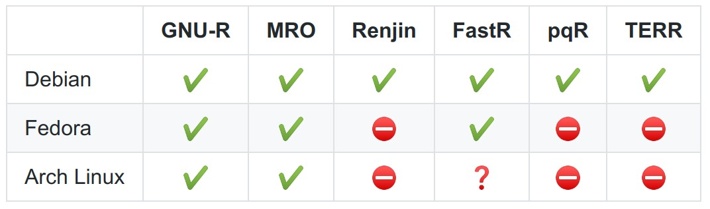
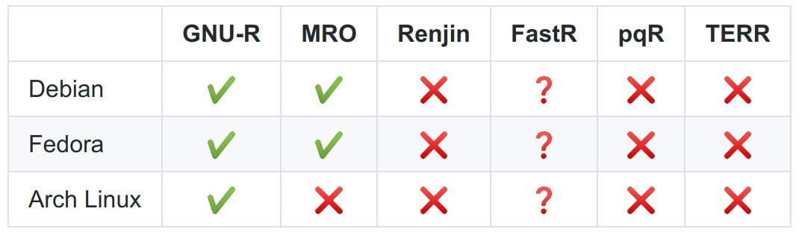
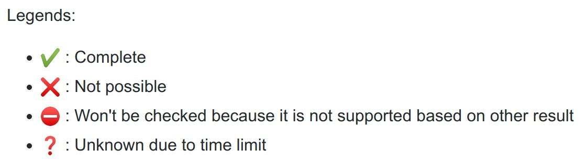

# Result and Analysis {#result-analysis}

In this part, the result of the research and the analysis of the result is shown.

## Docker Images

In this section, the exploration's result of each combination between R implementations and platforms for the R installation and geospatial packages installation are shown. The result is described per each R implementations. The overview of the result can be seen in figure \@ref(fig:docker-images-r) and \@ref(fig:docker-images-geospatial-r). There are some symbol in those two figures that can be explained using the legend in figure \@ref(fig:docker-images-legend)

```{r docker-images-r, echo=FALSE, fig.align='center', fig.cap='Docker Images with R', out.width = "400px"}

```

```{r docker-images-geospatial-r, echo=FALSE, fig.align='center', fig.cap='Docker Images with Geospatial R Pacakges', out.width = "400px"}

```

```{r docker-images-legend, echo=FALSE, fig.align='center', fig.cap='Legends', out.width = "200px"}

```

### GNU R

All combinations of GNU R with Debian, Fedora, and Arch Linux can be created for both vanilla R and with geospatial R packages. The only unsolved problem is installation of some system dependencies like `v8` and `saga-gis` on Arch Linux. Because of this R packages which needs this packages can not be installed also. Installation of system dependencies on docker image for Arch Linux is trickier compare to in Debian and Fedora for a package that exist in Arch User Repository (AUR)[@AURHome].

Another interesting result is that different PROJ/GDAL version gave a different result for an R code[@ProblemArchLinux]. The recently released GDAL version 3 is used in Arch Linux docker image while the Debian and Fedora use GDAL version 2.

### Microsoft R Open

Microsoft R Open only provides installer for Ubuntu, Windows, RHEL/CentOS, and SLES[@DownloadMRAN]. Docker image for Ubuntu is available from [@nustNuestMrodocker2019]. For Fedora it is possible to use the RHEL/CentOS installer. Unfortunately, it is not possible to install `sf` or other packages which needs PROJ althouth PROJ is already installed[@CanInstallSf]. The solution is using older version of Fedora, in this case Fedora 30 from previously Fedora 32. Fedora 30 has PROJ version 5.2 while Fedora 32 has PROJ version 6.2. It seems since MRO is based on R 3.5.3, the `sf` or other packages has better support to use older version of PROJ.

There is an MRO package for Arch Linux in AUR [@AURMicrosoftropen]. By using this package, MRO can be installed on Arch Linux. Unfortunately, the base image for Arch Linux that is used on the exploration is quite new (tag = 20200106)[@ImageLayerDetails]. This docker image has a new version of GDAL (3.0) which is not compatible with the `sf` version in the MRO 3.5.3 snapshot that still require GDAL 2.0. The difference is GDAL 3.0 no longer has resource files related to EPSG and ESRI CRS  databases like `pcs.csv`[@Release0NewsGDAL]. In this case there is a possibility to downgrade the installed packages or restore all packages to a specific date [@ArchLinuxArchive]. Unfortunately, this step is not taken due to time limit but can be tried in the future works.

### Renjin

Renjin docker image for Debian is available[@nustNuestRenjindockerDockerfiles2019]. Unfortunately, Renjin doesn't support `sf` [@RenjinOrgSf] because Renjin does not support `units` package [@RenjinOrgUnits] which is needed by `sf`. `units` package is not installed even though `udunits2` is available because Renjin does not support packages that depends on external libraries, in this case `udunits2`[@RccpNotFound]. By the same reasons, Fedora and Arch Linux will not be able to install geospatial packages.

### FastR

There is a docker image for FastR 3.4.0 on Debian[@nustNuestFastrdocker2019]. But there is a problem on installing `sf` package (one of the core geospatial packages). The problem is related to `proj` not found although it's already installed [@CanNotInstall]. The next attempt is using the latest FastR release 3.6.0, by extending an example from [@CouldnBuildFastr]. Unfortunately, the problem still exists. To check whether this problem is FastR specific or not, GNU R is installed for both docker images and it's possible to install `sf` on it. This means, the problem is specific to FastR.

Another attempt is using the the official GraalVM docker image [@OracleGraalvmceDocker] based on Oracle Linux 7. It's possible to install FastR 3.6.1 but not geospatial packages like `sf` because the GDAL is too old on Oracle Linux 7. It is solved by building GDAL from source [@262588213843476InstallGdalRedhat]. Similar problem (old package) also happens with `Pandoc` that is used for running the book knitting in SDSR. This is not mandatory though for geospatial workflow. Unfortunately, there is a code in SDSR book that doesn't run correctly like in GNU R or MRO related to `sf` [@SfInstalledNot].

From these results, it's concluded that it's not possible to install geospatial packages on FastR thus in the case of Arch Linux, it's not explored.


### pqR

There is already pqR docker image for Debian[@nustNuestPqrdocker2019]. Unfortunately, the latest version of pqR is based on GNU R 2.15.0 [@m.nealPqRPrettyQuick2019]. This makes geospatial packages like `sf` not compatible with it since `sf` needs R version > 3.3.0.[@pebesmaSfSimpleFeatures2019]. Since it is not possible to install geospatial R packages, the docker images for Fedora and Arch Linux are not created since it will not possible to install geospatial R packages also.

### TIBCO Enterprise Runtime for R (TERR)

Although TERR is not free and open, TIBCO provides TERR for free with Developer Evaluation license [@TIBCOEnterpriseRuntime]. This license has a limitation which prevent pubslishing the docker image of TERR[@TIBCOEnterpriseRuntime]. With this limitation, this research only provides Dockerfile to build the docker image that needs the installer that can be obtained from the TIBCO website. TERR is successfully installed for Debian and Ubuntu. Unfortunately, there is a problem when R geospatial packages are tried to be installed. If there is already a package installed, it is not possible to re-install the package. For example, package `vctrs` is already installed from another R packages installation, if we want to install `RSQLite` which depends on `vctrs` it will turns an error. From this problem, it is not possible to install geospatial packages which have a same R package dependency.

Since it is not possible to install R geospatial packages with Debian and Ubuntu, we do not continue the exploration for Fedora and Arch Linux.

## Benchmark

In this section, the result of the benchmark is shown and explained for baseline benchmark and geospatial workflow benchmark

```{r load_data, included=FALSE, echo=FALSE, results='hide', warning=FALSE, message=FALSE}
library('microbenchmark')
library('altRnative')
library('kableExtra')
baseline_benchmark = readRDS(file = "./data/simple_benchmark_result.rds")  # 1 + 1
benchmark_result_per_chapter = readRDS(file = "./data/benchmark_result.rds")  # per chapter
sdsr_code_benchmark = readRDS(file = "./data/sdsr_code_benchmark_result.rds") # all code in one run
nano_time_factor = 10^9
options(digits=3)
```

### Baseline Benchmark

`altRnative` package that is used for benchmarking is using docker images for each R implementation and platform. In this case there is already elapsed time for running the container and destroy it. Baseline benchmark is used to check the time spent for this process. To do it, a very simple R script (`1 + 1`) is run 10 times for each docker image. The summary can be seen at table \@ref(tab:summaryTableBaseline). It's clear that there is not so much different between docker images for this baseline benchmark. The distribution of the baseline benchmark is shown in box plot figure \@ref(fig:baseline-benchmark). There are two outliers observation, but in general the result is quite similar within 0.1 second range for the mean.

```{r create_summary_table_baseline, included=FALSE, echo=FALSE, results='hide', warning=FALSE, message=FALSE}
summaryTableBaseline <- baseline_benchmark %>% 
      group_by(expr) %>% 
      summarise(mintime = min(time) / nano_time_factor,
                meantime = mean(time) / nano_time_factor,
                mediantime = median(time) / nano_time_factor,
                maxtime = max(time) / nano_time_factor
                )
```

```{r summaryTableBaseline, results='asis', echo=FALSE, results='hold'}
summaryTableBaseline %>%
  kable(
    "latex",
    col.names = c("Docker Image", "Min", "Mean", "Median", "Max"),
    caption = "Baseline Benchmark",
    booktabs = T) %>%
  kable_styling(
    latex_options = "striped"
    )
```

```{r baseline-benchmark, echo=FALSE, fig.align='center', fig.cap='Baseline Benchmark', fig.width = 10, out.width=400, fig.show='hold'}
benchmark_boxplot(baseline_benchmark, main = 'Baseline Benchmark')
```

### Geospatial Workflow Benchmark

For running geospatial workflow, the code from SDSR book is extracted using an R script to avoid overhead time in knitting the book process. The result of this benchmark can be seen in table \@ref(tab:summaryTableSDSR) and its distribution in box plot figure \@ref(fig:sdsr-benchmark). In this result, there is no outlier for all docker images. We can see also that GNU R has better compared (~27-28 seconds) to MRO (~33 seconds) regarldess the operating system. For better view of the speed comparison, a normalized time is created by using the mean of time for GNU R on Debian as the baseline. The result is shown in table \@ref(tab:normalizeSummaryTableSDSR). It's clear that MRO needs 1.25x time compared to GNU R.

```{r create_summary_table_sdsr, included=FALSE, echo=FALSE, results='hide', warning=FALSE, message=FALSE}
summaryTableSDSR <- sdsr_code_benchmark %>% 
      group_by(expr) %>% 
      summarise(mintime = min(time) / nano_time_factor,
                meantime = mean(time) / nano_time_factor,
                mediantime = median(time) / nano_time_factor,
                maxtime = max(time) / nano_time_factor
                )
```

```{r create_summary_normalize_table_sdsr, included=FALSE, echo=FALSE, results='hide', warning=FALSE, message=FALSE}
normalizeSummaryTableSDSR <- sdsr_code_benchmark %>% 
      normalize_benchmark_result('gnu-r on debian') %>%
      group_by(expr) %>% 
      summarise(mintime = min(time),
                meantime = mean(time),
                mediantime = median(time),
                maxtime = max(time)
                )
```

```{r summaryTableSDSR, results='hold', echo=FALSE}
summaryTableSDSR %>%
  kable(
    "latex",
    col.names = c("Docker Image", "Min", "Mean", "Median", "Max"),
    caption = "SDSR Benchmark",
    booktabs = T) %>%
  kable_styling(
    latex_options = "striped"
    )
```

```{r normalizeSummaryTableSDSR, results='hold', echo=FALSE}
normalizeSummaryTableSDSR %>%
  kable(
    "latex",
    col.names = c("Docker Image", "Min", "Mean", "Median", "Max"),
    caption = "Normalized SDSR Benchmark",
    booktabs = T) %>%
  kable_styling(
    latex_options = "striped"
    )
```

```{r sdsr-benchmark, echo=FALSE, fig.align='center', fig.cap='Duration for All Code SDSR Benchmark', fig.width = 10, out.width=400, fig.show='hold'}
benchmark_boxplot(sdsr_code_benchmark, main = 'Duration for All Code SDSR Benchmark')
```

```{r ratio-sdsr-benchmark, echo=FALSE, fig.align='center', fig.cap='Duration Ratio for All SDSR Code', fig.width = 10, out.width=400, fig.show='hide'}
normalize_benchmark_boxplot(
    sdsr_code_benchmark, 
    baseline_image = 'gnu-r on debian', 
    main = 'Duration Ratio for All SDSR Code'
    )
```
