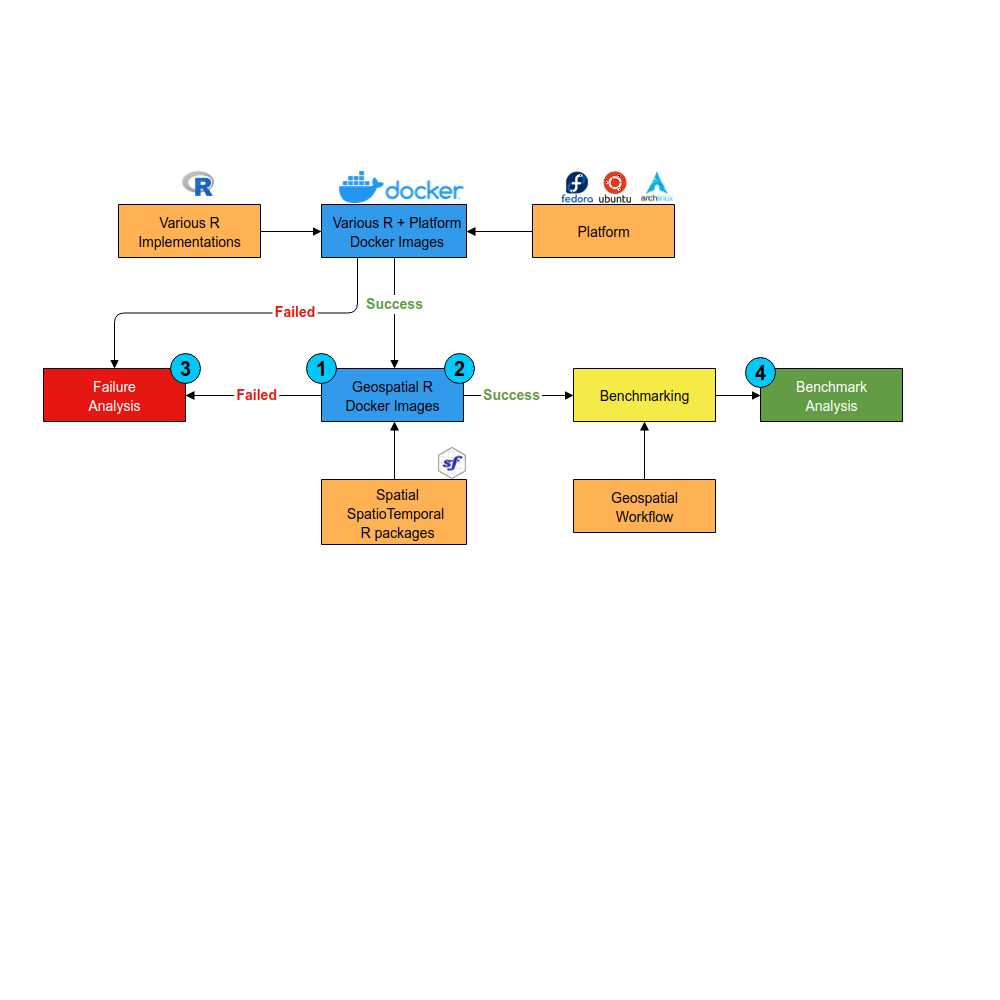

# Methodology {#methodology}

In this chapter, the methodology of the research is explained. For better understanding, the methodology is shown as in \@ref(fig:methodology). From this big diagram, there are three main parts.

```{r methodology, echo=FALSE, fig.align='center', fig.cap='Methodology', out.width = "400px"}

```

## Docker Images

The first step is creating docker images for each combination of platform and R implementations. The research uses 6 R implementations (GNU-R, MRO, Renjin, FastR, pqR, and TERR) and 3 platforms (Debian, Fedora, and Arch Linux). It is possible to use another platform with the same package manager if it's found that there is already a working docker image or there is a problem with current platform. This changes for example Ubuntu for Debian.

After that, the system dependencies for geospatial R packages are installed. The list of dependencies are taken from [@RhubSysreqsdb2019] database. If there is uninstalled system dependencies or missing dependencies, they are noted and reported to the repository. The next step is installing all R packages in the Spatial and SpatioTemporal view by using CTV packages[@NA] wherever possible. If it is not possible, installing one by one packages will be done. All failed installation will be tried to fix or noted if it is not possible to fix.

In the end, there are 36 docker images for all combination between platforms, R implementations, and geospatial R packages if all is done.

## Benchmarking

An R package, altRnative[@sunniIsmailsunniAltRnative2019], is created to make the benchmarking process easier. This R package uses microbenchmark to handle the benchmarking process[@mersmannMicrobenchmarkAccurateTiming2019] and stevedore for the docker client manipulation [@fitzjohnStevedoreDockerClient2019]. By using altRnative package, the benchmark between sucessful docker image is done by running code inside the modified [@sunniIsmailsunniSdsr2019]the Spatial Data Science R book[@pebesmaEdzerSdsr2019]. The modification is needed since there is a part that needs large external data.

The benchmark process is run on XPS 9360 laptop with core i7 8th gen processor, 16 GB RAM, and SSD. Any other unneeded application beside the benchmarking is killed so that they wouldn't disturb the benchmarking process.

## Analysis

Based on the first two part result, analysis is done. There is one analysis for each result.

### Failure Analysis

In the process of docker image creation including R installation, system dependencies installation, and R package installation it is expected that there will be a problem or an error in the process. Theses problems is tried to be solved as part of the methodology. Some problems can fixed and some others can not be done in the time of this research. All those problem will be grouped by the charactheristic and then it can be seen what's the most common one.

### Benchmark Analysis

The result of the benchmark will be analysed. Depending on the result, it will be checked what is the reason if there is a slower or faster combination in the bencmark.