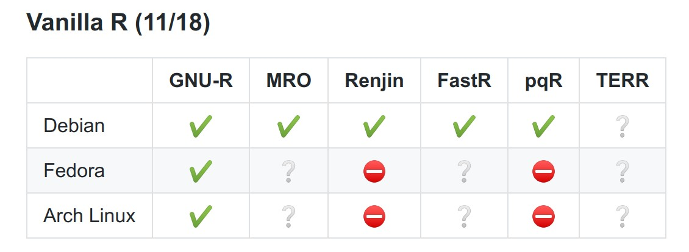
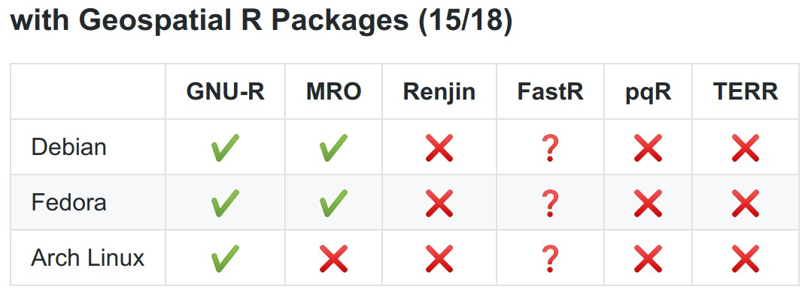
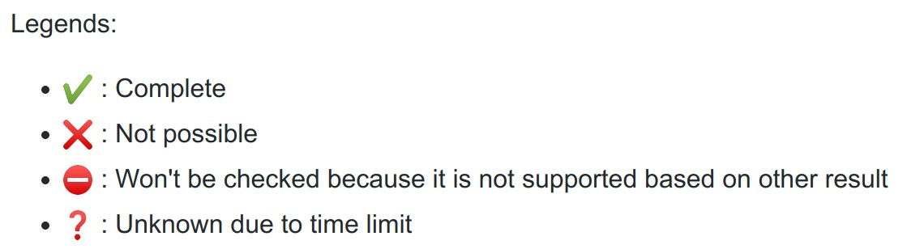

# Result and Analysis {#result-analysis}

In this part, the result of the research and the analysis of the result is shown.

## Docker Images

In this section, the exploration's result of each combination between R implementations and platforms for the R installation and geospatial packages installation are shown. The result is described per each R implementations. The overview of the result can be seen in figure \@ref(fig:docker-images-r) and \@ref(fig:docker-images-geospatial-r). There are some symbol in those two figures that can be explained using the legend in figure \@ref(fig:docker-images-legend)

```{r docker-images-r, echo=FALSE, fig.align='center', fig.cap='Docker Images with R', out.width = "400px"}

```

```{r docker-images-geospatial-r, echo=FALSE, fig.align='center', fig.cap='Docker Images with Geospatial R Pacakges', out.width = "400px"}

```

```{r docker-images-legend, echo=FALSE, fig.align='center', fig.cap='Legends', out.width = "200px"}

```

### GNU R

All combinations of GNU R with Debian, Fedora, and Arch Linux can be created for both vanilla R and with geospatial R packages. The only unsolved problem is installation of some system dependencies like `v8` and `saga-gis`. Because of this R packages which needs this packages can not be installed also. Installation of system dependencies on docker image for Arch Linux is trickier compare to in Debian and Fedora for a package that exist in Arch User Repository (AUR)[@AURHome].

Another interesting result is that different PROJ/GDAL version gave a different result for an R code[@ProblemArchLinux]. The recently released GDAL version 3 is used in Arch Linux docker image while the Debian and Fedora use GDAL version 2.

### Microsoft R Open

Microsoft R Open only provides installer for Ubuntu, Windows, RHEL/CentOS, and SLES[@DownloadMRAN]. Docker image for Ubuntu is available from [@nustNuestMrodocker2019]. For Fedora it is possible to use the RHEL/CentOS installer. Unfortunately, it is not possible to install `sf` or other packages which needs PROJ althouth PROJ is already installed[@CanInstallSf]. The solution is using older version of Fedora, in this case Fedora 30 from previously Fedora 32. Fedora 30 has PROJ version 5.2 while Fedora 32 has PROJ version 6.2. It seems since MRO is based on R 3.5.3, the `sf` or other packages has better support to use older version of PROJ.

Since the Arch Linux installer is not available and it is a lot of work compared to the research duration, the docker image for Arch Linux is not created.

### Renjin


### FastR

### pqR

### TIBCO Enterprise Runtime for R (TERR)

## Geospatial Workflow Benchmark

Lorem ipsum