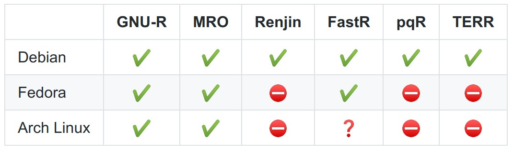

# Result and Analysis {#result-analysis}

Lorem ipsum

## Docker Images

In this section, the exploration's result of each combination between R implementations and platforms for the R installation and geospatial packages installation are shown. The result is described per each R implementations. The overview of the result can be seen in figure \@ref(fig:docker-images-r) and \@ref(fig:docker-images-geospatial-r). There are some symbol in those two figures that can be explained using the legend in figure \@ref(fig:docker-images-legend)

```{r docker-images-r, echo=FALSE, fig.align='center', fig.cap='Docker Images with R', out.width = "400px"}

```

```{r docker-images-geospatial-r, echo=FALSE, fig.align='center', fig.cap='Docker Images with Geospatial R Pacakges', out.width = "400px"}
knitr::include_graphics('./figure/docker_images_geospatial.jpg')
```

```{r docker-images-legend, echo=FALSE, fig.align='center', fig.cap='Legends', out.width = "200px"}
knitr::include_graphics('./figure/docker_images_legend.jpg')
```

### GNU R

### Microsoft R Open

### Renjin

### FastR

### pqR

### TIBCO Enterprise Runtime for R (TERR)

## Geospatial Workflow Benchmark

Lorem ipsum