`r if(knitr:::is_latex_output()) '\\appendix'`

`r if(!knitr:::is_latex_output()) '# (APPENDIX) Appendix {-}'` 

<!--
If you feel it necessary to include an appendix, it goes here.
-->


# Source Code

This appendix contains links to the source code that is used for this research.

1. The R package to run you R code in different R implementations and platforms on a docker container: [altRnative](https://github.com/ismailsunni/altRnative)
2. A collection of docker image of various R implementations on various platform both vanilla and with geospatial R packages: [dockeRs](https://github.com/ismailsunni/dockeRs)
3. This master thesis writing: [master-thesis](https://github.com/ismailsunni/master-thesis)

# SDSR Benchmark per Chapter

This appendix contains all the result of benchmark per chapter in the SDSR book.

## Box Plot for Duration

In this part, all box plot for each chapter duration are shown.

```{r 01-hello-sdsr-benchmark, echo=FALSE, fig.align='center', fig.cap='SDSR Benchmark Chapter 01 hello', out.width = "400px"}
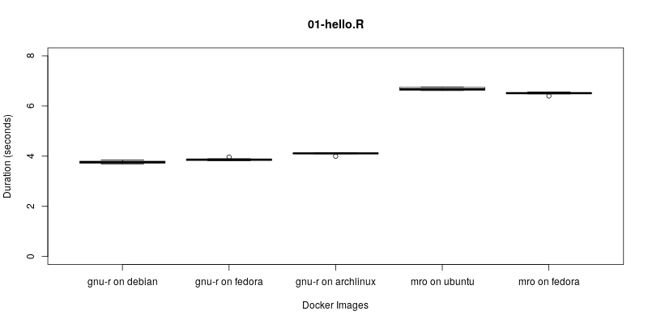
```

```{r 02-spaces-sdsr-benchmark, echo=FALSE, fig.align='center', fig.cap='SDSR Benchmark Chapter 02 Spaces', out.width = "400px"}
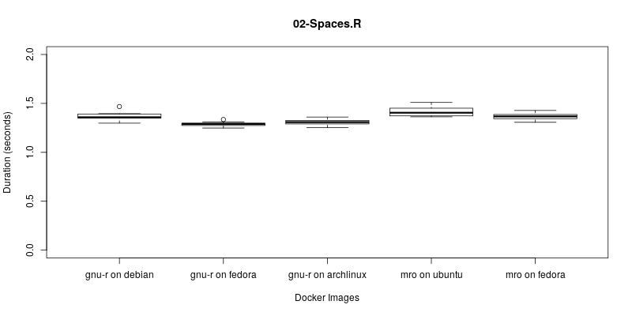
```

```{r 03-geometries-sdsr-benchmark, echo=FALSE, fig.align='center', fig.cap='SDSR Benchmark Chapter 03 Geometries', out.width = "400px"}
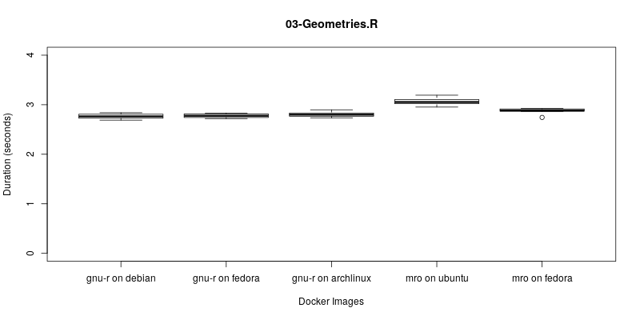
```

```{r 04-raster-cube-sdsr-benchmark, echo=FALSE, fig.align='center', fig.cap='SDSR Benchmark Chapter 04 Raster Cube', out.width = "400px"}
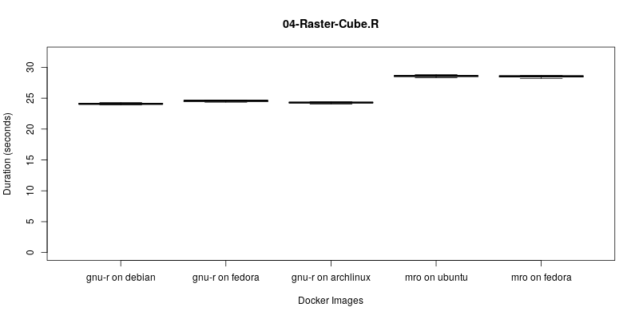
```

```{r 05-geommanipulations-sdsr-benchmark, echo=FALSE, fig.align='center', fig.cap='SDSR Benchmark Chapter 05 GeomManipulations', out.width = "400px"}
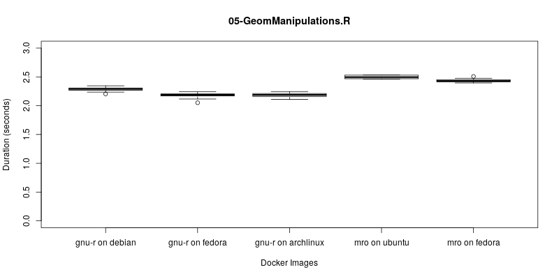
```

```{r 06-attributes-sdsr-benchmark, echo=FALSE, fig.align='center', fig.cap='SDSR Benchmark Chapter 06 Attributes', out.width = "400px"}
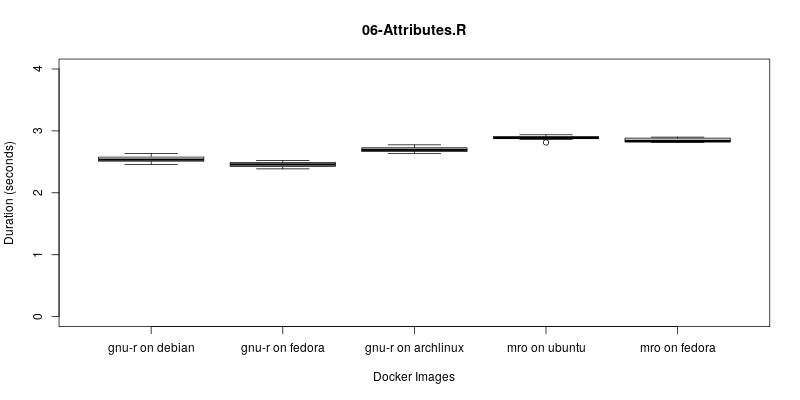
```

```{r 07-referencesystems-sdsr-benchmark, echo=FALSE, fig.align='center', fig.cap='SDSR Benchmark Chapter 07 Reference Systems', out.width = "400px"}
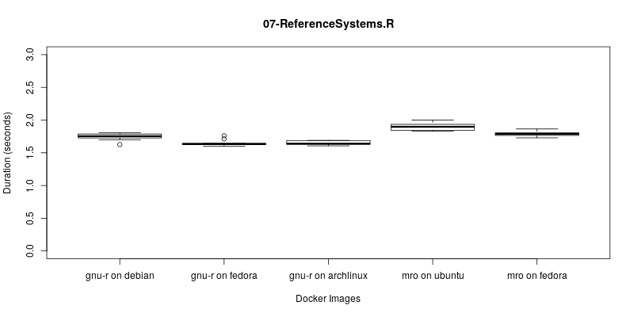
```

```{r 08-plotting-sdsr-benchmark, echo=FALSE, fig.align='center', fig.cap='SDSR Benchmark Chapter 08 Plotting', out.width = "400px"}
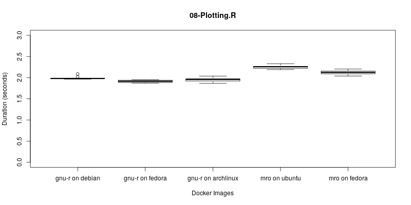
```

```{r 09-baseplot-sdsr-benchmark, echo=FALSE, fig.align='center', fig.cap='SDSR Benchmark Chapter 09 BasePlot', out.width = "400px"}
knitr::include_graphics('./figure/plots/09-BasePlot.png')
```

```{r 10-ggplot2-sdsr-benchmark, echo=FALSE, fig.align='center', fig.cap='SDSR Benchmark Chapter 10 Ggplot2', out.width = "400px"}
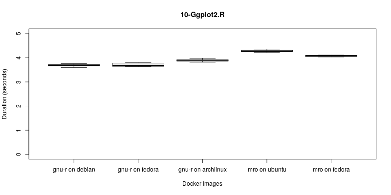
```

```{r 98-rbascis-sdsr-benchmark, echo=FALSE, fig.align='center', fig.cap='SDSR Benchmark Chapter 98 rbascis', out.width = "400px"}
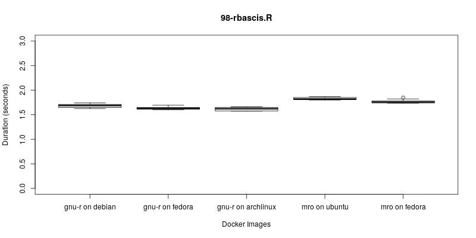
```

## Box Plot for Duration Ratio

In this part, all box plot for each chapter duration ratio are shown.

```{r ratio-01-hello-sdsr-benchmark, echo=FALSE, fig.align='center', fig.cap='SDSR Benchmark Chapter 01 hello (Duration Ratio)', out.width = "400px"}
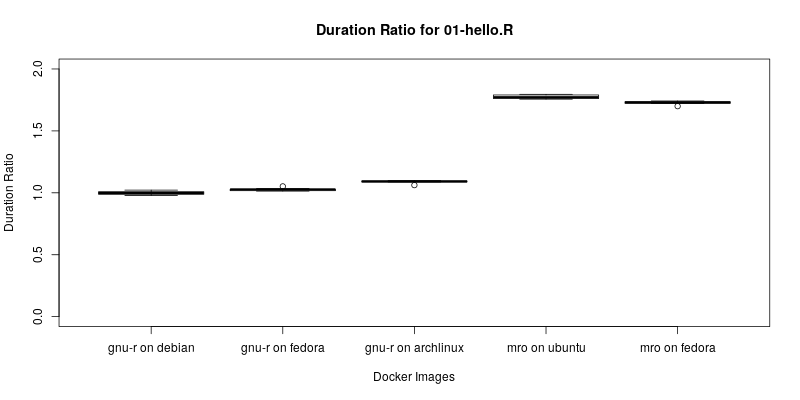
```

```{r ratio-02-spaces-sdsr-benchmark, echo=FALSE, fig.align='center', fig.cap='SDSR Benchmark Chapter 02 Spaces (Duration Ratio)', out.width = "400px"}
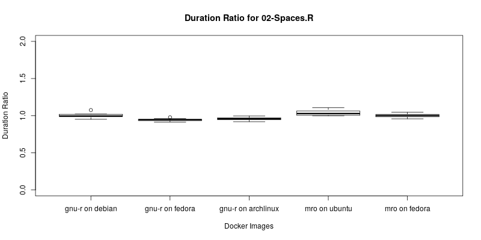
```

```{r ratio-03-geometries-sdsr-benchmark, echo=FALSE, fig.align='center', fig.cap='SDSR Benchmark Chapter 03 Geometries (Duration Ratio)', out.width = "400px"}
knitr::include_graphics('./figure/plots/ratio_03-Geometries.png')
```

```{r ratio-04-raster-cube-sdsr-benchmark, echo=FALSE, fig.align='center', fig.cap='SDSR Benchmark Chapter 04 Raster Cube (Duration Ratio)', out.width = "400px"}
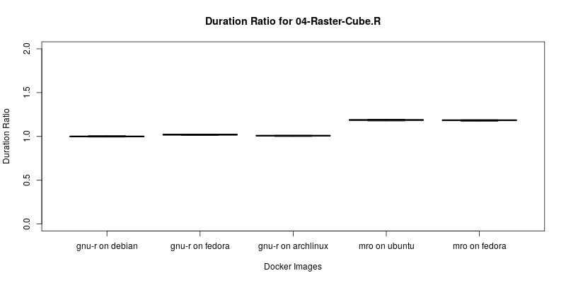
```

```{r ratio-05-geommanipulations-sdsr-benchmark, echo=FALSE, fig.align='center', fig.cap='SDSR Benchmark Chapter 05 GeomManipulations (Duration Ratio)', out.width = "400px"}
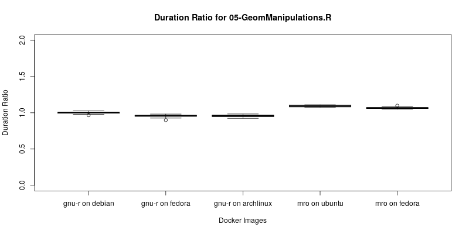
```

```{r ratio-06-attributes-sdsr-benchmark, echo=FALSE, fig.align='center', fig.cap='SDSR Benchmark Chapter 06 Attributes (Duration Ratio)', out.width = "400px"}
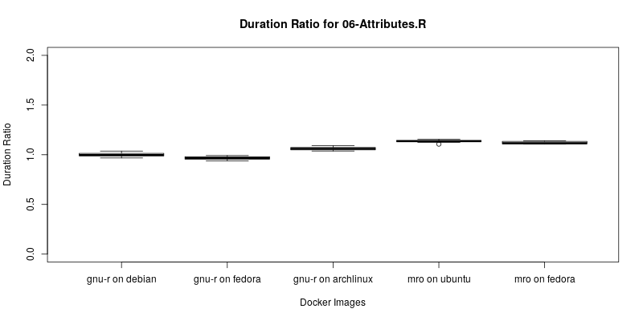
```

```{r ratio-07-referencesystems-sdsr-benchmark, echo=FALSE, fig.align='center', fig.cap='SDSR Benchmark Chapter 07 Reference Systems (Duration Ratio)', out.width = "400px"}
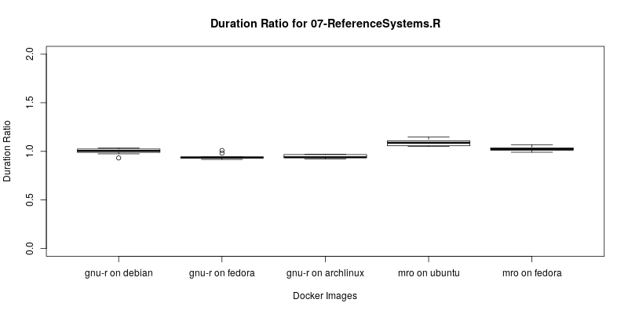
```

```{r ratio-08-plotting-sdsr-benchmark, echo=FALSE, fig.align='center', fig.cap='SDSR Benchmark Chapter 08 Plotting (Duration Ratio)', out.width = "400px"}
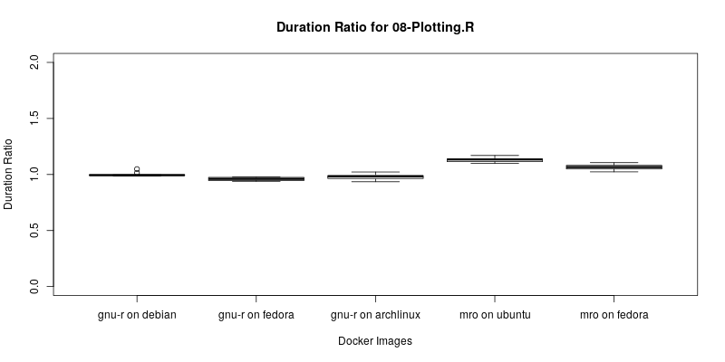
```

```{r ratio-09-baseplot-sdsr-benchmark, echo=FALSE, fig.align='center', fig.cap='SDSR Benchmark Chapter 09 BasePlot (Duration Ratio)', out.width = "400px"}

```

```{r ratio-10-ggplot2-sdsr-benchmark, echo=FALSE, fig.align='center', fig.cap='SDSR Benchmark Chapter 10 Ggplot2 (Duration Ratio)', out.width = "400px"}
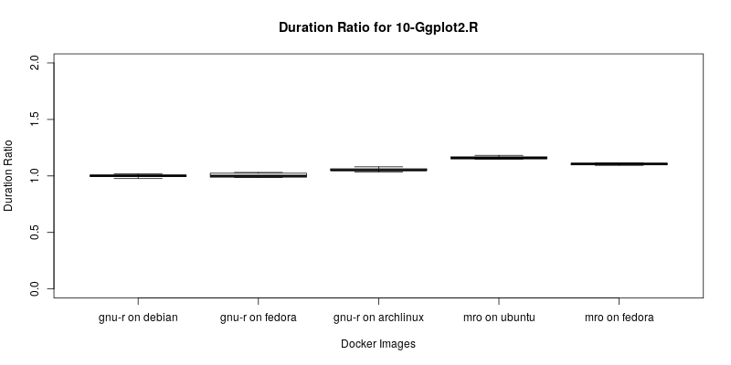
```

```{r ratio-98-rbascis-sdsr-benchmark, echo=FALSE, fig.align='center', fig.cap='SDSR Benchmark Chapter 98 rbascis (Duration Ratio)', out.width = "400px"}
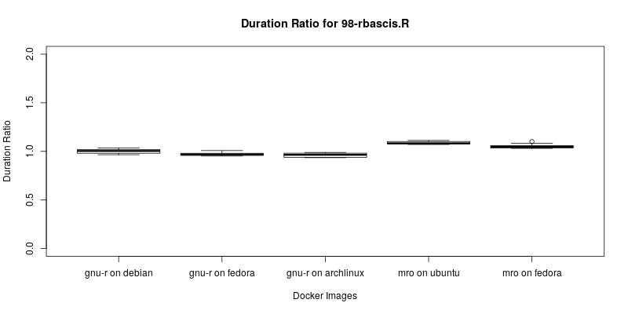
```
